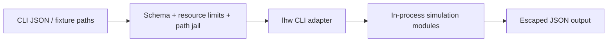

# Security — Linux Host Workbench

## Trust Boundaries

## Threat Model

| Threat | Example | Control |
| --- | --- | --- |
| Code execution | input treated as JS/shell | parse JSON only; no `eval`; no `child_process` for user input |
| Resource exhaustion | huge PID trees / socket tables | hard caps before allocation |
| Path traversal | hostile fixture paths | root jail on optional file reads |
| Privilege escalation claims | “run this against prod hosts” | no live privileged probes; ADR-001 banners |
| Credential leakage | cloud keys / SSH keys in fixtures | no cloud IAM SDKs; redact patterns in stderr |
| Supply-chain compromise | malicious dependency | lockfile, audit, minimal deps |
| Scope misuse as container/K8s tool | build images / apply manifests | ADR-001/005 non-goals |

## Controls

The package needs no credentials for core labs. Fixtures are data-only. Optional local experiments on a developer’s own machine are outside CI and must never be required for green tests. Advisories and playbook outputs are educational—not authorization to skip change control on production hosts.

## Security Acceptance

- Negative tests cover malformed, oversized, deeply nested, and hostile path inputs.
- `npm audit` findings triaged by exploitability before release.
- Publish token scope is publish-only; unavailable to pull-request jobs.
- Limitations link to [[10-Linux/projects/Linux Host Workbench/Known Issues|Known Issues]] and [[10-Linux/projects/Linux Host Workbench/Postmortem|Postmortem]].

## Related Documents

- [[10-Linux/projects/Linux Host Workbench/ADR/ADR-001 Simulation Scope|ADR-001]]
- [[10-Linux/projects/Linux Host Workbench/Testing|Testing]]
- [[10-Linux/09-Security-Primitives-on-the-Host/Capabilities vs root All-Powerful Myth|Capabilities vs root]]
