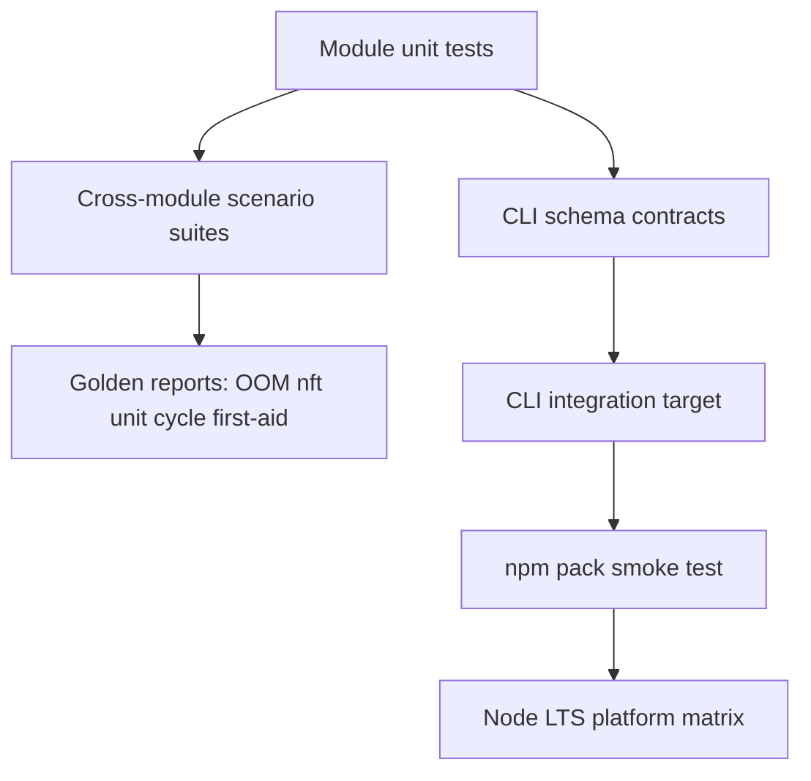

# Testing — Linux Host Workbench

## Strategy



## Test Layers

| Layer | Coverage |
| --- | --- |
| Unit | procfs field parse, cgroup tokens, nft match, unit cycle DFS, signal thresholds |
| Integration | first-aid merge of upstream reports; noisy-neighbor + OOM; listen conflict + nft drop |
| Contract | JSON CLI schemas, stderr/stdout separation, exit codes |
| Package | install tarball, import facade, invoke `lhw` entry |
| Platform | Windows/Linux/macOS on Node 20+ LTS **without** Docker/K8s/live VM |

## Current Command

```bash
cd 10-Linux/code
npm install
npm test
```

Target executable coverage: labs under `10-Linux/code/tests`. Required additions include facade export smoke tests, CLI schema validation, hostile input fixtures, golden scenarios for cgroup/nft/systemd/first-aid, and packed-artifact smoke tests.

## Module Test Filters

| Focus | Suggested filter |
| --- | --- |
| Procfs | `Procfs\|parseStat\|parseStatus` |
| Cgroup | `BudgetClinic\|Cgroup` |
| Network | `NetworkTriage\|Nftables\|Conntrack` |
| systemd | `SystemdUnit\|Hardening\|Timer` |
| Observability | `FirstAid\|GoldenSignal\|Playbook` |

## Related Documents

- [[10-Linux/projects/Linux Host Workbench/API|API]]
- [[10-Linux/projects/Linux Host Workbench/Requirements|Requirements]]
- [[10-Linux/projects/Linux Host Workbench/ADR/ADR-001 Simulation Scope|ADR-001]]
