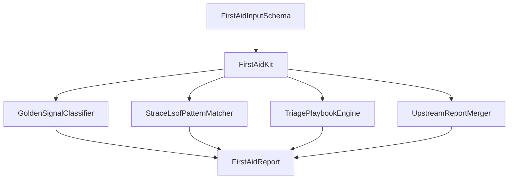

# Architecture — Observability First-Aid Kit

## Summary

A pure TypeScript first-aid correlator: host signal fixtures + optional trace snippets in → ordered triage report out. Target module: `10-Linux/code/src/observability-first-aid.ts`. Composes other mini-project report shapes without requiring live VMs ([[10-Linux/projects/Linux Host Workbench/ADR/ADR-001 Simulation Scope|ADR-001]]).

## Component Diagram

## Formula / Contract Boundaries (Scaffold)

| Concern | Teaching contract | Explicit non-claim |
| --- | --- | --- |
| Golden signals | Threshold tables for latency/errors/traffic/saturation proxies on one host | Not multi-service SLOs (→ System Design) |
| strace patterns | Regex/token fixtures → hypothesis enum | Not full syscall decoder |
| lsof | FD type counts / deleted-file flags | Not live `/proc/<pid>/fd` walk in CI |
| perf | Optional top-frame histogram narrative | Not `perf.data` parser |
| Correlation | Merge optional procfs/cgroup/net/systemd reports | Not distributed tracing product |

## Scaffold Notes

1. Keep classifiers pure and threshold-configurable via JSON; document defaults.
2. Cap snippet length and event merges; return `LIMIT_EXCEEDED`.
3. Playbook step IDs are compatibility surfaces for golden tests.
4. Pair with [[10-Linux/12-Incidents-Runbooks-and-Portfolio/Host Incident Triage Order CPU Mem Disk Net|Host Incident Triage Order]].

## Related Documents

- [[10-Linux/projects/Observability First-Aid Kit/README|README]]
- [[10-Linux/projects/Linux Host Workbench/API|Workbench API]]
- [[10-Linux/projects/Procfs Inspector Lab/README|Procfs Inspector Lab]]
- [[10-Linux/projects/Cgroup Budget Clinic/README|Cgroup Budget Clinic]]
- [[10-Linux/projects/Host Network Triage Toolkit/README|Host Network Triage Toolkit]]
- [[10-Linux/projects/systemd Unit Workshop/README|systemd Unit Workshop]]
