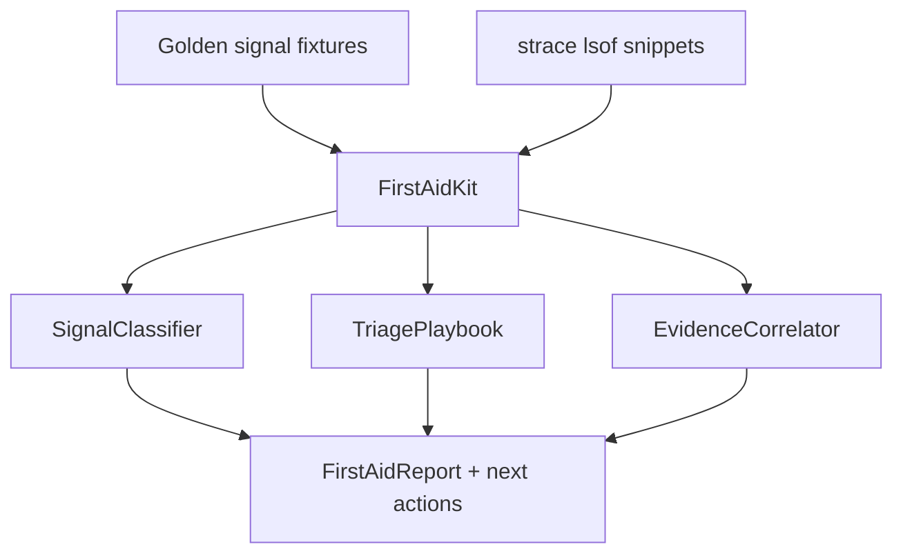

# Observability First-Aid Kit

## Overview

A host **first-aid triage kit**: golden-signal classifiers, ordered tool playbooks (`strace`/`lsof`/`perf` intuition), and correlated fixture timelines—so learners practice “what to run next” on a single box without claiming APM/SaaS parity.

## Goals

- Encode CPU/mem/disk/net golden-signal thresholds into deterministic classifiers.
- Emit ordered triage steps with expected evidence artifacts.
- Correlate synthetic `strace`/`lsof` snippet fixtures with likely root-cause classes.
- Integrate outputs from procfs, cgroup, network, and systemd minis into one incident narrative.

## Prerequisites

- [[10-Linux/08-Observability-Tracing-and-Profiling/Metrics from procfs and sysfs|Metrics from procfs and sysfs]]
- [[10-Linux/08-Observability-Tracing-and-Profiling/strace and lsof First-Aid Tracing|strace and lsof First-Aid Tracing]]
- [[10-Linux/08-Observability-Tracing-and-Profiling/perf CPU Profiles and Flame Graph Intuition|perf CPU Profiles and Flame Graph Intuition]]
- [[10-Linux/08-Observability-Tracing-and-Profiling/Logging Correlation on a Single Host|Logging Correlation on a Single Host]]
- [[10-Linux/12-Incidents-Runbooks-and-Portfolio/Host Incident Triage Order CPU Mem Disk Net|Host Incident Triage Order CPU Mem Disk Net]]
- [[10-Linux/12-Incidents-Runbooks-and-Portfolio/Golden Signals on a Single Box|Golden Signals on a Single Box]]
- [[10-Linux/code/README|Linux Code Labs]]

## Architecture

See [[10-Linux/projects/Observability First-Aid Kit/Architecture|Architecture]] for classifier boundaries.

## Spec

| Concern | Spec |
| --- | --- |
| Inputs | Host metrics snapshot + optional trace/lsof snippets + prior mini-project reports |
| Outputs | Saturated resource enum, ordered next tools, evidence checklist, confidence |
| Determinism | Same inputs → identical JSON; step clock only |
| Honesty | Teaching playbooks; not Prometheus/Grafana/eBPF product |
| Limits | Cap snippet lines and correlated event count |
| Code targets | `observability-first-aid.ts`; tests under `10-Linux/code/tests` |

## Acceptance Criteria

- [ ] Classifies at least CPU / memory / disk / network saturation from fixture thresholds.
- [ ] Emits ordered first-aid steps matching [[10-Linux/12-Incidents-Runbooks-and-Portfolio/Host Incident Triage Order CPU Mem Disk Net|Host Incident Triage Order]].
- [ ] Maps common `strace` patterns (EAGAIN loops, hang on futex, ENOENT storms) to hypotheses.
- [ ] Accepts optional upstream reports from procfs/cgroup/net/systemd minis without requiring live hosts.
- [ ] Report lists confidence and “stop conditions” (escalate vs keep digging).
- [ ] No privileged `perf`/`strace` against live PIDs in CI (ADR-001).
- [ ] Export wires into [[10-Linux/projects/Linux Host Workbench/README|Linux Host Workbench]] facade.

## Stretch

1. Flame-graph *intuition* fixture: stack histogram → top frames narrative (not real perf.data).
2. eBPF “when to reach for it” decision tree linked to [[10-Linux/08-Observability-Tracing-and-Profiling/eBPF Intro for Operators|eBPF Intro]].
3. Evidence pack export for [[10-Linux/12-Incidents-Runbooks-and-Portfolio/Postmortem Evidence Collection on Linux|Postmortem Evidence Collection]].

## Related Notes

- [[10-Linux/projects/Observability First-Aid Kit/Architecture|Architecture]]
- [[10-Linux/projects/Linux Host Workbench/README|Linux Host Workbench]]
- [[10-Linux/README|Linux MOC]]
- [[10-Linux/code/README|Linux Code Labs]]
- [[10-Linux/12-Incidents-Runbooks-and-Portfolio/Linux Host Workbench Portfolio Map|Linux Host Workbench Portfolio Map]]
- [[Career/README|Career]]

## Progress Checklist

- [ ] Scaffold `observability-first-aid` module + Vitest fixtures
- [ ] Wire CLI command `lhw obs triage --input … --json`
- [ ] Golden multi-signal incident fixtures
- [ ] Document gaps vs production APM / continuous profiling
- [ ] Mark mini project complete in track Implementation Checklist
