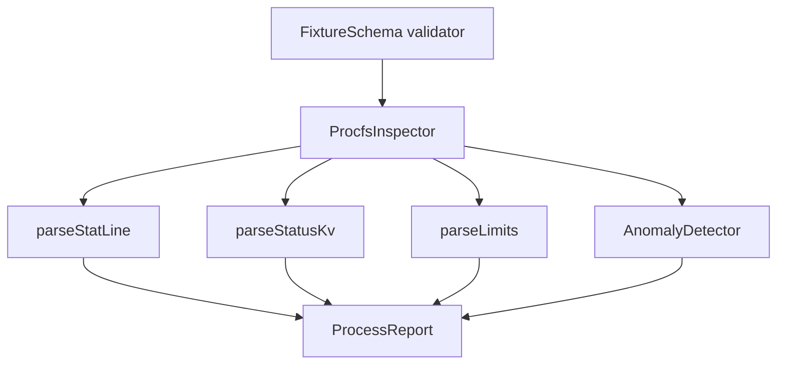

# Architecture — Procfs Inspector Lab

## Summary

A pure TypeScript inspector over **procfs-shaped fixtures**: no live `/proc` mounts, no SSH, no VM. Fixture in → process/anomaly report out. Target module: `10-Linux/code/src/procfs-inspector.ts`.

## Component Diagram

## Formula / Contract Boundaries (Scaffold)

| Concern | Teaching contract | Explicit non-claim |
| --- | --- | --- |
| `stat` | Fixed-field subset (pid, state, ppid, utime, stime, nice, num_threads) | Not every arch-specific field |
| RSS/VSZ | Prefer `status` VmRSS/VmSize kB → bytes | Not precise PSS/USS accounting |
| Zombies | State `Z` flag | Not full reaper policy sim |
| Limits | Soft/hard proximity % | Not full `prlimit` syscall surface |
| Paths | Root-jailed fixture roots | Never follow host `/proc` in CI |

## Scaffold Notes

1. Keep parsers pure; normalize newlines; reject null bytes and path escapes.
2. Cap PID count and per-PID FD enumeration; return `LIMIT_EXCEEDED` rather than hang.
3. Export types from the Workbench facade; CLI only validates and serializes.
4. Pair with [[10-Linux/02-Processes-Signals-and-Job-Control/Process Lifecycle ps and procfs|Process Lifecycle ps and procfs]] for narrative method.

## Related Documents

- [[10-Linux/projects/Procfs Inspector Lab/README|README]]
- [[10-Linux/projects/Linux Host Workbench/API|Workbench API]]
- [[10-Linux/projects/Linux Host Workbench/ADR/ADR-001 Simulation Scope|ADR-001]]
