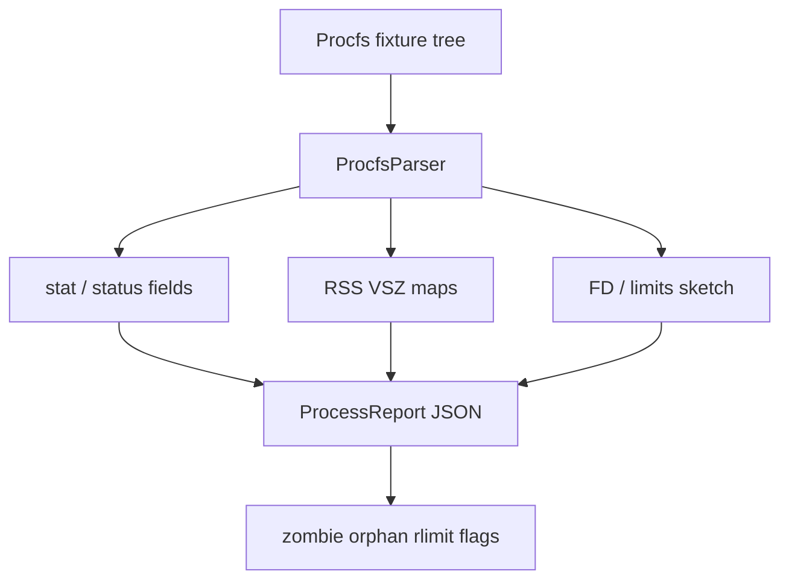

# Procfs Inspector Lab

## Overview

Parse **fixture trees that mimic `/proc`** into typed process views: `stat`/`status`, RSS vs VSZ, open FD counts, and state transitions—teaching operators to read kernel-exported process truth without scraping live hosts in CI.

## Goals

- Encode procfs field contracts as typed parsers with stable error codes.
- Surface RSS vs VSZ, threads, nice, and state as first-class report fields.
- Detect zombies/orphans and rlimit pressure from fixture snapshots.
- Produce deterministic JSON suitable for interview walkthroughs and Workbench CLI.

## Prerequisites

- [[10-Linux/02-Processes-Signals-and-Job-Control/Process Lifecycle ps and procfs|Process Lifecycle ps and procfs]]
- [[10-Linux/02-Processes-Signals-and-Job-Control/Signals Delivery and Common Handlers|Signals Delivery and Common Handlers]]
- [[10-Linux/02-Processes-Signals-and-Job-Control/Limits ulimit and rlimits|Limits ulimit and rlimits]]
- [[10-Linux/02-Processes-Signals-and-Job-Control/Zombies Orphans and Reaping Failures|Zombies Orphans and Reaping Failures]]
- [[10-Linux/03-Memory-Swap-and-OOM/Virtual Memory Ops RSS vs VSZ|Virtual Memory Ops RSS vs VSZ]]
- [[10-Linux/code/README|Linux Code Labs]]

## Architecture

See [[10-Linux/projects/Procfs Inspector Lab/Architecture|Architecture]] for schema and parser boundaries.

## Spec

| Concern | Spec |
| --- | --- |
| Inputs | Directory or JSON fixture mimicking `/proc/<pid>/` (`stat`, `status`, optional `limits`, `fd` count) |
| Outputs | Typed process table + anomaly flags; deterministic key order |
| Determinism | Same fixture → identical JSON; no wall-clock in report body |
| Honesty | Not a live `ps` replacement; field coverage is teaching subset |
| Limits | Cap PID count and fixture depth; reject hostile paths |
| Code targets | `procfs-inspector.ts`; tests under `10-Linux/code/tests` |

## Acceptance Criteria

- [ ] Parser accepts fixture tree/JSON and rejects invalid schemas with stable error codes.
- [ ] Maps `stat` state codes and reports RSS/VSZ from `status` Vm* fields.
- [ ] Flags zombies (Z), orphans (ppid=1 with expected parent gone in fixture), and soft-limit proximity.
- [ ] Report JSON is deterministic and lists `assumptions[]` / uncovered fields.
- [ ] Unit tests cover happy path + malformed/oversized fixtures; no live `/proc` required (ADR-001).
- [ ] Export wires into [[10-Linux/projects/Linux Host Workbench/README|Linux Host Workbench]] facade.

## Stretch

1. Diff two snapshots and emit “new / gone / state-changed” process deltas.
2. OOM-score ranking overlay from fixture `oom_score` files.
3. Correlate FD count pressure with [[10-Linux/projects/Host Network Triage Toolkit/README|Host Network Triage Toolkit]] socket tables.

## Related Notes

- [[10-Linux/projects/Procfs Inspector Lab/Architecture|Architecture]]
- [[10-Linux/projects/Linux Host Workbench/README|Linux Host Workbench]]
- [[10-Linux/README|Linux MOC]]
- [[10-Linux/code/README|Linux Code Labs]]
- [[10-Linux/08-Observability-Tracing-and-Profiling/Metrics from procfs and sysfs|Metrics from procfs and sysfs]]
- [[Career/README|Career]]

## Progress Checklist

- [ ] Scaffold `procfs-inspector` module + Vitest fixtures
- [ ] Wire CLI command `lhw procfs inspect --input … --json`
- [ ] Cross-link reports into Workbench triage demos
- [ ] Document field subset vs live kernel versions
- [ ] Mark mini project complete in track Implementation Checklist
