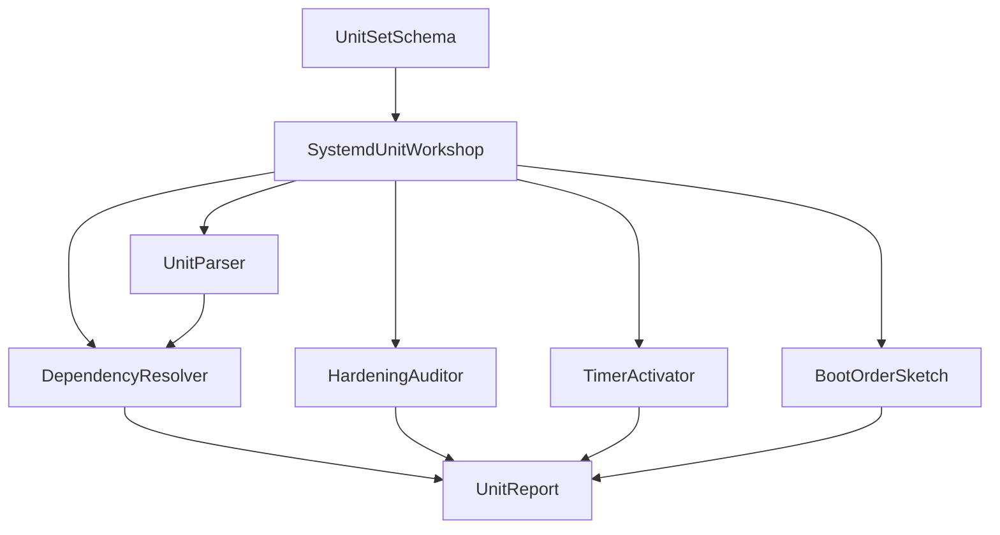

# Architecture — systemd Unit Workshop

## Summary

TypeScript unit-file workshop over fixtures: no dbus, no PID 1. Unit set in → graph/hardening/timer report out. Target module: `10-Linux/code/src/systemd-unit-workshop.ts`. Teaching default is **systemd-as-init** ([[10-Linux/projects/Linux Host Workbench/ADR/ADR-003 systemd-as-init Teaching Default|ADR-003]]).

## Component Diagram

## Formula / Contract Boundaries (Scaffold)

| Concern | Teaching contract | Explicit non-claim |
| --- | --- | --- |
| Dependencies | `Requires`/`Wants`/`After`/`Before` edges | Not full transaction engine |
| Types | service, timer, target subset | Not socket/path/mount/device full matrix |
| Hardening | Checklist against known directives | Not seccomp profile compiler |
| Timers | Simplified OnCalendar / OnUnitActive | Not full calendar expression grammar |
| journald | Optional ring rate-limit stretch | Not journald binary format |

## Scaffold Notes

1. Normalize unit names (`.service` suffix); reject path escapes in `ExecStart` for CI safety.
2. Cap unit count and edge fan-out; return `LIMIT_EXCEEDED`.
3. Cycle detection must be deterministic (stable unit sort before DFS/Kahn).
4. Pair with [[10-Linux/06-systemd-Timers-and-Logging/Unit Types Dependencies and Targets|Unit Types Dependencies and Targets]].

## Related Documents

- [[10-Linux/projects/systemd Unit Workshop/README|README]]
- [[10-Linux/projects/Linux Host Workbench/API|Workbench API]]
- [[10-Linux/projects/Linux Host Workbench/ADR/ADR-003 systemd-as-init Teaching Default|ADR-003]]
