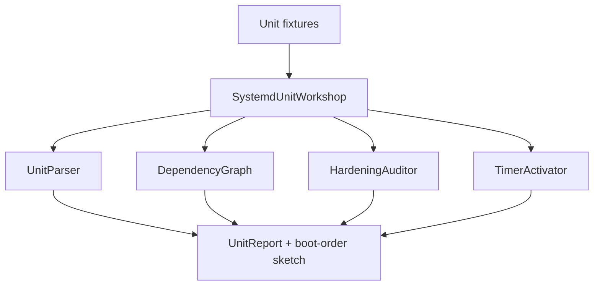

# systemd Unit Workshop

## Overview

Build and validate **systemd unit graphs** from fixture unit files: dependencies, targets, restart policies, hardening directives, and timer calendars—teaching init/service literacy with **systemd-as-init** as the default mental model (ADR-003).

## Goals

- Parse a teaching subset of unit directives into typed graphs.
- Resolve `Requires`/`Wants`/`After`/`Before` and detect cycles / missing units.
- Evaluate hardening directives (`ProtectSystem`, `NoNewPrivileges`, etc.) as a checklist report.
- Model timer → service activation without claiming full calendar expression parity.

## Prerequisites

- [[10-Linux/06-systemd-Timers-and-Logging/Unit Types Dependencies and Targets|Unit Types Dependencies and Targets]]
- [[10-Linux/06-systemd-Timers-and-Logging/Service Hardening Directives|Service Hardening Directives]]
- [[10-Linux/06-systemd-Timers-and-Logging/Timers vs Cron Operational Choice|Timers vs Cron Operational Choice]]
- [[10-Linux/06-systemd-Timers-and-Logging/journald Persistence and Rate Limits|journald Persistence and Rate Limits]]
- [[10-Linux/06-systemd-Timers-and-Logging/Boot Rescue Targets and Failed Units|Boot Rescue Targets and Failed Units]]
- [[10-Linux/projects/Linux Host Workbench/ADR/ADR-003 systemd-as-init Teaching Default|ADR-003]]
- [[10-Linux/code/README|Linux Code Labs]]

## Architecture

See [[10-Linux/projects/systemd Unit Workshop/Architecture|Architecture]] for directive coverage.

## Spec

| Concern | Spec |
| --- | --- |
| Inputs | Set of `.service`/`.timer`/`.target` fixture texts or JSON ASTs |
| Outputs | Dependency graph, cycle flags, hardening gaps, timer→service map |
| Determinism | Same units → identical JSON; no dbus to live systemd |
| Honesty | Teaching subset of directives; not systemd PID 1 |
| Limits | Cap unit count and dependency fan-out |
| Code targets | `systemd-unit-workshop.ts`; tests under `10-Linux/code/tests` |

## Acceptance Criteria

- [ ] Parses teaching directive subset and builds directed dependency graph.
- [ ] Detects cycles and missing `Requires` targets with stable error/domain codes.
- [ ] Hardening auditor lists present vs recommended directives for a service class.
- [ ] Timer fixtures activate associated services on a step calendar (simplified).
- [ ] Default narrative assumes systemd as init (ADR-003); SysV contrast is documentation-only.
- [ ] No live `systemctl`/`busctl` required in CI (ADR-001).
- [ ] Export wires into [[10-Linux/projects/Linux Host Workbench/README|Linux Host Workbench]] facade.

## Stretch

1. journald rate-limit ring tied to unit stdout floods.
2. Rescue-target reachability after simulated failed critical unit.
3. Drop-in override merge order lab (`foo.service.d/*.conf`).

## Related Notes

- [[10-Linux/projects/systemd Unit Workshop/Architecture|Architecture]]
- [[10-Linux/projects/Linux Host Workbench/README|Linux Host Workbench]]
- [[10-Linux/README|Linux MOC]]
- [[10-Linux/code/README|Linux Code Labs]]
- [[16-DevOps/README|DevOps]]
- [[Career/README|Career]]

## Progress Checklist

- [ ] Scaffold `systemd-unit-workshop` module + Vitest fixtures
- [ ] Wire CLI command `lhw systemd validate --input … --json`
- [ ] Golden cycle + hardening gap fixtures
- [ ] Document directive subset vs live systemd versions
- [ ] Mark mini project complete in track Implementation Checklist
