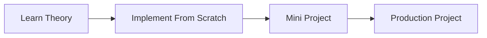

# 18 Security

## Objectives

- Understand the fundamentals
- Learn how it works internally
- Build practical projects
- Prepare for interviews
- Apply concepts in production

## Roadmap

## Topics

_TODO_

## Mini Projects

_TODO_

## Portfolio Project

_TODO_

## Exercises

_TODO_

## Interview Questions

_TODO_

## References

_TODO_
