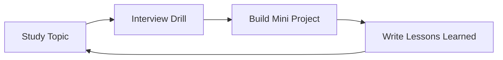

# Career

Professional practice materials: interview preparation, growth frameworks, communication, and operating as a primary engineer on production systems.

## Objectives

- Convert curriculum knowledge into interview signal
- Practice explaining trade-offs under time pressure
- Build habits for design docs, ADRs, and postmortems
- Track growth against production responsibilities

## Suggested Structure

```text
Career/
  Interviews/
  System-Design-Drills/
  Behavioral/
  Growth/
```

Use [[00-Templates/Interview Questions Template|Interview Questions Template]] for reusable question sets. Prefer linking back to topic notes instead of duplicating theory.

## Practice Loop



## Topics

- CS interview drills (module sets): see [[01-Computer-Science/README|Computer Science]] → Interview Questions
- JavaScript interview drills: see [[02-JavaScript/_interview/README|JavaScript Interview Questions]]
- Python interview drills: see [[03-Python/_interview/README|Python Interview Questions]]
- Data Structures interview drills: see [[04-Data-Structures/_interview/README|Data Structures Interview Questions]]
- Data Structures exercises for implementation practice: see [[04-Data-Structures/_exercises/README|Data Structures Exercises]]
- Algorithms interview drills: see [[05-Algorithms/_interview/README|Algorithms Interview Questions]]
- Algorithms exercises for implementation practice: see [[05-Algorithms/_exercises/README|Algorithms Exercises]]
- Algorithms pattern catalog and complexity communication: see [[05-Algorithms/13-Production-Selection-and-Interview-Patterns/Interview Pattern Catalog and Complexity Communication|Interview Pattern Catalog and Complexity Communication]]
- Node.js interview drills: see [[06-NodeJS/_interview/README|Node.js Interview Questions]]
- Node.js exercises for runtime mechanism practice: see [[06-NodeJS/_exercises/README|Node.js Exercises]]
- Node.js code labs for event loop, streams, HTTP, workers, shutdown, and diagnostics: see [[06-NodeJS/code/README|Node.js code labs]]
- Backend interview drills: see [[07-Backend/_interview/README|Backend Interview Questions]]
- Backend exercises for API contracts, auth, reliability, and caching patterns: see [[07-Backend/_exercises/README|Backend Exercises]]
- Backend code labs for Express middleware, validation, auth, rate limits, cache-aside, outbox, and OpenAPI: see [[07-Backend/code/README|Backend code labs]]
- Additional career notes — planned

## Related Notes

- [[00-Introduction/Roadmap|Master Roadmap]]
- [[Projects/README|Projects]]
- [[01-Computer-Science/README|Computer Science]]
- [[02-JavaScript/README|JavaScript]]
- [[03-Python/README|Python]]
- [[04-Data-Structures/README|Data Structures]]
- [[05-Algorithms/README|Algorithms]]
- [[06-NodeJS/README|Node.js]]
- [[07-Backend/README|Backend]]
- [[00-Templates/Interview Questions Template|Interview Questions Template]]
