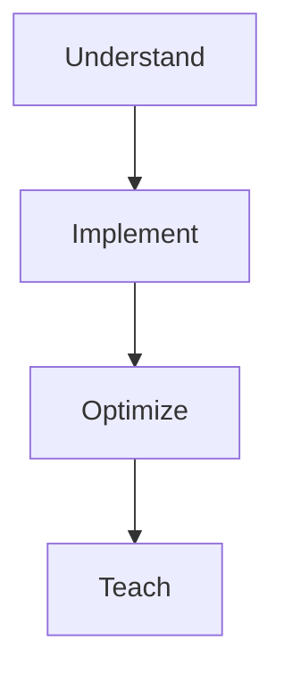
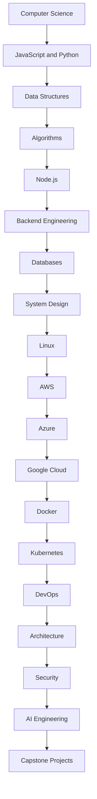

# Software Engineering Bible

A production-oriented software engineering curriculum designed as an Obsidian vault and a public GitHub learning repository.

This is **not** a dump of notes. It is a complete curriculum that teaches concepts from first principles through implementation, optimization, documentation, and production projects.

## Purpose

Become capable of designing distributed systems, building enterprise SaaS, and understanding technologies from first principles — not by memorizing APIs, but by answering:

- What is it?
- Why was it invented?
- What problem does it solve?
- How does it work internally?
- What are the trade-offs?
- When should I use it?
- When should I not use it?
- How would I implement one myself?
- How would large companies use it?

## Learning Model

If you cannot teach a concept, you do not yet understand it.

## Start Here

| Path | Purpose |
| --- | --- |
| [[00-Introduction/README\|Introduction]] | Onboarding and how to use this vault |
| [[00-Introduction/Roadmap\|Master Roadmap]] | Canonical curriculum map |
| [ROADMAP.md](ROADMAP.md) | Phased build plan for the repository (Phase 3 in progress — Databases complete) |
| [[00-Templates/README\|Templates]] | Note and project templates |
| [CONTRIBUTING.md](CONTRIBUTING.md) | Writing and contribution standards |
| [CHANGELOG.md](CHANGELOG.md) | Release history |

## Curriculum Tracks

1. [[01-Computer-Science/README|Computer Science]] — foundational track complete (topics, labs, exercises, projects)
2. [[02-JavaScript/README|JavaScript]] — language internals, async runtime, modules, labs, and projects
3. [[03-Python/README|Python]] — CPython 3.14+ language/runtime track with labs and projects
4. [[04-Data-Structures/README|Data Structures]] — ADTs, layouts, invariants, dual-language labs, exercises, and projects (67 topics)
5. [[05-Algorithms/README|Algorithms]] — complexity, correctness, dual-language labs, exercises, and projects (70 topics)
6. [[06-NodeJS/README|Node.js]] — V8/libuv host runtime, streams, networking, workers, diagnostics, supply chain, and production Node (11 modules, 62 topics)
7. [[07-Backend/README|Backend]] — HTTP/API contracts, Express middleware, auth, reliability, caching/jobs, data access, observability, and production services (11 modules, 62 topics)
8. [[08-Databases/README|Databases]] — storage engines, WAL, indexing, transactions, Postgres/Mongo/Redis depth, and production ops (13 modules, 65 topics)
9. [[09-System-Design/README|System Design]]
10. [[10-Linux/README|Linux]]
11. [[11-AWS/README|AWS]]
12. [[12-Azure/README|Azure]]
13. [[13-Google-Cloud/README|Google Cloud]]
14. [[14-Docker/README|Docker]]
15. [[15-Kubernetes/README|Kubernetes]]
16. [[16-DevOps/README|DevOps]]
17. [[17-Architecture/README|Architecture]]
18. [[18-Security/README|Security]]
19. [[19-AI/README|AI]]
20. [[20-Capstone-Projects/README|Capstone Projects]]

Supporting sections:

- [[Projects/README|Projects]] — production project documentation
- [[Career/README|Career]] — interviews, growth, and professional practice
- [[00-References/README|References]] — curated sources
- [[00-Assets/README|Assets]] — diagrams, images, and shared media

## How Each Topic Is Structured

Every concept is its own Markdown note and follows the [[00-Templates/Topic Template|Topic Template]]:

- Overview and learning objectives
- Prerequisites, difficulty, estimated time
- History and the problem it solves
- Internal implementation
- Mermaid diagrams
- Examples and trade-offs
- Exercises, mini project, portfolio project
- Interview questions
- Common mistakes and best practices
- Related notes and progress checklist

## Obsidian Usage

1. Open this repository folder as an Obsidian vault.
2. Use templates from `00-Templates/`.
3. Prefer Obsidian wiki links: `[[Hash Tables]]`, `[[Redis]]`, `[[Caching]]`.
4. Keep headings and Mermaid diagrams GitHub-flavored Markdown so notes remain readable on GitHub.
5. Do not commit personal workspace layout, cache, or device-specific Obsidian state.

Portable vault settings live in [`.obsidian/app.json`](.obsidian/app.json) and [`.obsidian/templates.json`](.obsidian/templates.json).

## Repository Rules

- Never oversimplify. Prefer first principles.
- Explain trade-offs explicitly.
- Visualize important concepts with Mermaid.
- Cross-link related notes.
- Include exercises, projects, and interview questions.
- Document architecture decisions, bugs, and postmortems.
- Prefer production-quality explanations over tutorial shortcuts.

## Licensing

This repository uses a dual license:

- Educational prose, diagrams, and curriculum Markdown: [CC BY 4.0](LICENSE-CONTENT)
- Source code and executable examples: [MIT](LICENSE-CODE)

See [LICENSE](LICENSE) for boundary rules.

## Contributing

Read [CONTRIBUTING.md](CONTRIBUTING.md) before opening a pull request. Quality over speed. Treat every note as if thousands of engineers will read it.
