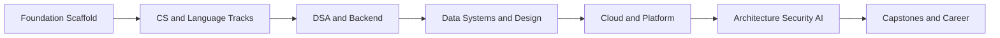

# Repository Roadmap

This document tracks how the Software Engineering Bible itself is built. For the learner-facing curriculum map, see [[00-Introduction/Roadmap|Master Roadmap]].

## Guiding Constraint

Never sacrifice quality for speed. Each phase must leave the vault internally consistent, production-oriented, and ready for public review.

## Phased Delivery

### Phase 0 — Foundation Scaffold

Status: complete

- Root navigation and governance files
- Obsidian information architecture
- Curriculum and project templates
- Portable vault configuration
- Dual licensing and contribution standards

Exit criteria:

- Every track README is reachable from root README and master roadmap
- Templates cover topic notes and production projects
- Personal Obsidian state is not committed

### Phase 1 — Computer Science, JavaScript, Python

Status: complete

- [x] Fill [[01-Computer-Science/README|Computer Science]] with first-principles topic notes, labs, exercises, interviews, and projects
- [x] Build [[02-JavaScript/README|JavaScript]] internals track (semantics, engine, event loop, promises, modules, production)
- [x] Build [[03-Python/README|Python]] track (data model, CPython runtime, typing, concurrency, packaging, production)
- [x] Seed CS, JavaScript, and Python mini projects, portfolio docs, and interview question sets

### Phase 2 — Data Structures, Algorithms, Node.js, Backend

Status: complete

- [x] Complete [[04-Data-Structures/README|Data Structures]] with from-scratch implementations, dual labs, exercises, interviews, and projects
- [x] Complete [[05-Algorithms/README|Algorithms]] with complexity analysis, dual labs, exercises, interviews, and projects
- [x] Complete [[06-NodeJS/README|Node.js]] production track (host runtime, streams, networking, workers, diagnostics, supply chain, production ops)
- [x] Complete [[07-Backend/README|Backend]] production track (HTTP/API contracts, Express, auth, reliability, caching/jobs, data access, observability, production services)
- [x] Document ADRs for major backend choices ([[07-Backend/projects/Backend Service Toolkit/ADR/ADR-001 Express as Teaching Default|Backend Service Toolkit ADRs]])

### Phase 3 — Databases and System Design

Status: complete

- [x] Complete [[08-Databases/README|Databases]] across relational, document, and caching systems
- [x] Complete [[09-System-Design/README|System Design]] with capacity, consistency, and failure modes
- [x] Add reference architectures and trade-off matrices

### Phase 4 — Linux, Cloud, Containers, DevOps

Status: in progress — next milestone [[11-AWS/README|AWS]] (M13)

- [x] Complete [[10-Linux/README|Linux]] with processes, filesystems, networking, cgroups, systemd, and host observability
- Complete [[11-AWS/README|AWS]], [[12-Azure/README|Azure]], [[13-Google-Cloud/README|Google Cloud]]
- Complete [[14-Docker/README|Docker]], [[15-Kubernetes/README|Kubernetes]], [[16-DevOps/README|DevOps]]
- Prefer portable concepts over vendor trivia

### Phase 5 — Architecture, Security, AI

- Complete [[17-Architecture/README|Architecture]], [[18-Security/README|Security]], [[19-AI/README|AI]]
- Emphasize production failure modes, threat models, and evaluation criteria

### Phase 6 — Capstones, Projects, Career

- Expand [[20-Capstone-Projects/README|Capstone Projects]], [[Projects/README|Projects]], and [[Career/README|Career]]
- Require postmortems, engineering journals, and ADRs for major projects
- Prepare public GitHub release polish

## Near-Term Milestones

| Milestone | Outcome | Status |
| --- | --- | --- |
| M0 | Foundation scaffold merged and usable as an empty curriculum skeleton | complete |
| M1 | First complete topic note published from the Topic Template | complete |
| M2 | Computer Science track has full topic list, notes, labs, exercises, interviews | complete |
| M3 | First production project documentation set instantiated from templates | complete (CS portfolio workbench) |
| M4 | JavaScript track includes complete notes, labs, practice, and projects | complete |
| M5 | Python track includes complete notes, labs, practice, and projects | complete |
| M6 | Data Structures track includes complete notes, dual labs, practice, and projects | complete |
| M7 | Algorithms track includes complexity analysis, dual labs, exercises, and implementations | complete |
| M8 | Node.js track includes complete notes, labs, practice, and projects | complete |
| M9 | Backend track includes complete notes, labs, practice, and projects | complete |
| M10 | Databases track includes storage engines, indexing, transactions, and modeling trade-offs | complete |
| M11 | System Design track includes capacity, consistency, partitioning, and failure modes | complete |
| M12 | Linux track includes processes, filesystems, networking, and observability basics | complete |
| M13 | AWS track includes portable cloud concepts with vendor-specific mapping where useful | pending |

## Explicit Non-Goals for Phase 0

- Writing full curriculum topic bodies
- Filling every track with content
- Committing a full Obsidian plugin ecosystem
- Perfecting visual theme or workspace layout
